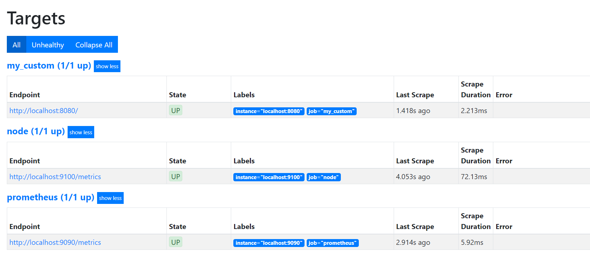
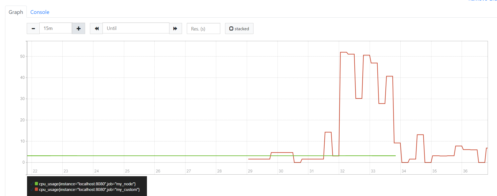
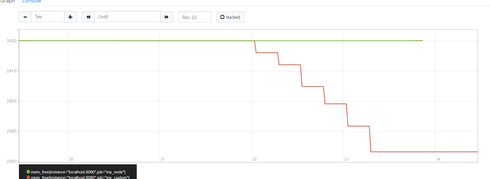
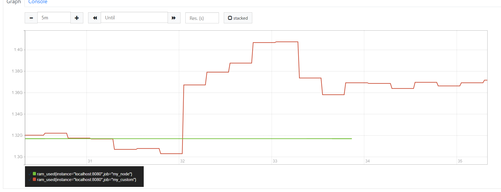
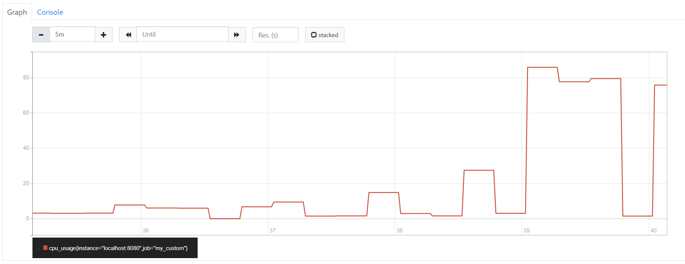

# Part 8. Свой node_exporter
## 1. Создание bash-скриптов и изменение конфигурационных файлов <br/>

* Напишем bash-скрипт `get_info.sh`, который собирает информацию по базовым метрикам системы (ЦПУ, оперативная память, жесткий диск (объем)). <br/>
* Скрипт формирует html-страницу `index.html` по формату Prometheus, которую будет отдавать nginx. <br/>
* Страница обновляется внутри bash-скрипта `main.sh` в цикле каждые 3 сек. <br/>
* Внесем изменения в конфигурационный файл `/etc/nginx/nginx.conf` <br/>
    ```sh
    http {
        server {
		listen 8080;
		location / {
			root /usr/share/nginx/html;
			index index.html;
		}
	}}
    ```
* Внесем изменения в файл `/etc/prometheus/prometheus.yml` <br/>
    ```sh
    - job_name: 'my_custom'
    metrics_path: /
    static_configs:
      - targets: ['localhost:8080']
    ```
* Установим `sudo apt-get install bc` 
* Запустим скрипт и проверим, что по адресу `http://localhost:9090/` добавились новые метрики <br/>
    !

## 2. Проведение тестов <br/>

* Запустим bash-скрипт из `Part 2`<br/>
* Проверим результаты работы
    
    
    
    
* Запустим команду
    ```sh
    stress -c 2 -i 1 -m 1 --vm-bytes 32M -t 60s
    ```
* Проверим результаты работы
    
    