## Part 1. Готовый докер

1. Взять официальный докер образ с nginx и выкачать его при помощи docker pull;

Выкачивание официального докер образа:
> sudo docker pull nginx

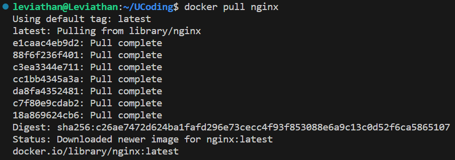

 

2. Проверить на наличие докер образа через docker images;

> sudo docker images

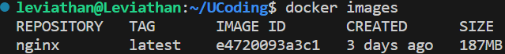

 

3. Запустить докер образ через docker run -d [image_id|repository]. Проверить, что образ запустился через docker ps;

> sudo docker run -d *image id*

> sudo docker ps

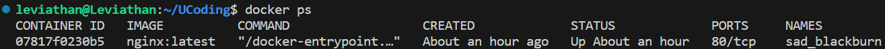

 

4. Посмотреть информацию о контейнере через docker inspect [container_id|container_name];

> sudo docker inspect *container id*

размер контейнера: **67108864**

список замапленных портов: **80/tcp**

ip контейнера: **172.17.0.2**

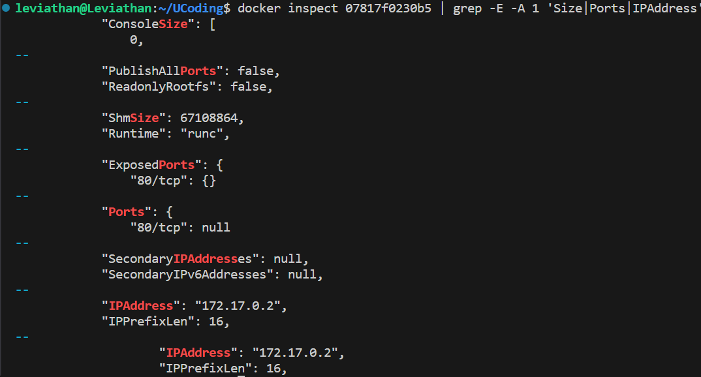

 

5. Остановить докер образ через docker stop [container_id|container_name];

> sudo docker stop *container id*

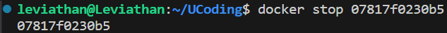

 

6. Проверить, что образ остановился через docker ps;

> sudo docker ps

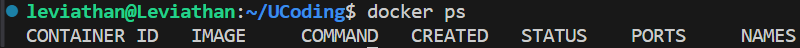

 

7. Запустить докер с портами 80 и 443 в контейнере, замапленными на такие же порты на локальной машине, через команду run;

> sudo docker run -d -p 80:80 -p 443:443 nginx

 

8. Проверить, что в браузере по адресу localhost:80 доступна стартовая страница nginx;

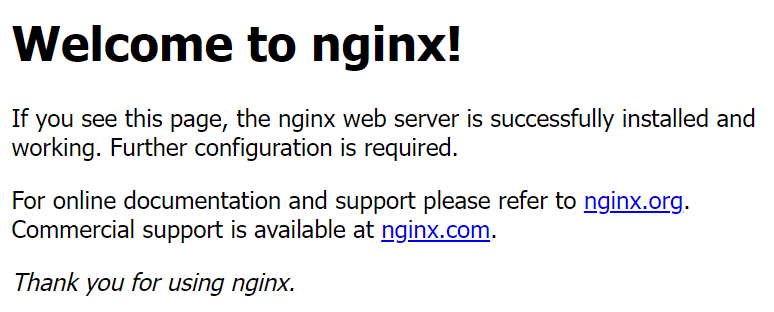

 

9. Перезапустить докер контейнер через docker restart [container_id|container_name]. Проверить любым способом, что контейнер запустился.

> sudo docker restart *container id*

> sudo docker ps

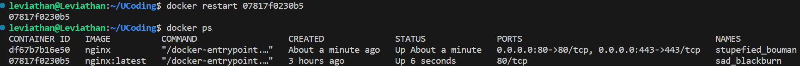

 

## Part 2. Операции с контейнером

1. Прочитать конфигурационный файл nginx.conf внутри докер контейнера через команду exec;

> sudo docker exec *container id* cat /etc/nginx/nginx.conf

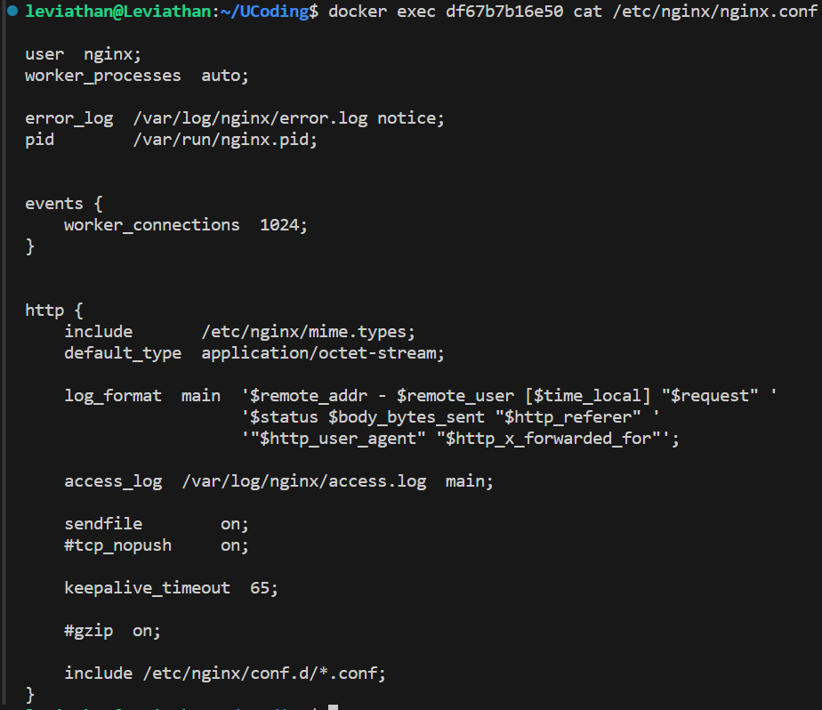

 

2. Создать на локальной машине файл nginx.conf. Настроить в нем по пути /status отдачу страницы статуса сервера nginx;

> cat nginx.conf

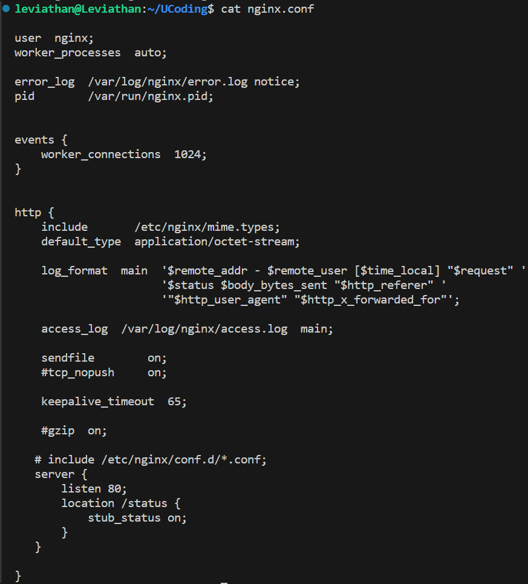

 

3. Скопировать созданный файл nginx.conf внутрь докер образа через команду docker cp. Перезапустить nginx внутри докер образа через команду exec;

> sudo docker cp nginx.conf container_id:/etc/nginx/nginx.conf

> sudo docker exec container_id nginx -s reload 

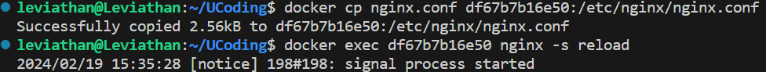

 

4. Проверить, что по адресу localhost:80/status отдается страничка со статусом сервера nginx;

> sudo curl localhost:80/status/

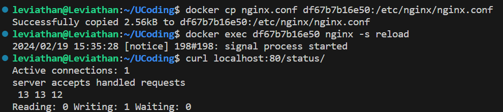

 

5. Экспортировать контейнер в файл container.tar через команду export;

> sudo docker export container_id -o container.tar

> ls

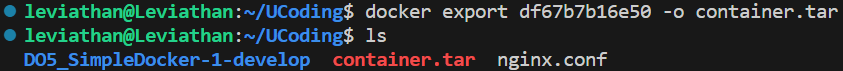

 

6. Остановить контейнер. Удалить образ через docker rmi [image_id|repository], не удаляя перед этим контейнеры. Удалить остановленный контейнер;

> sudo docker stop container_id

> sudo docker rmi nginx -f

> sudo docker rm container_id

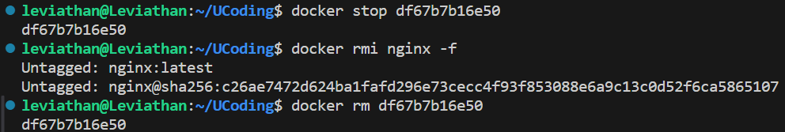
 
 

7. Импортировать контейнер обратно через команду import;

> sudo docker import -c 'CMD ["nginx", "-g", "daemon off;"]' container.tar import_nginx

> sudo docker images

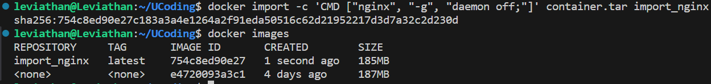

 

8. Запустить импортированный контейнер;

> sudo docker run -d -p 80:80 -p 443:443 import_nginx

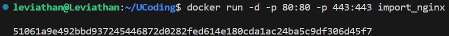

 

9. Проверить, что по адресу localhost:80/status отдается страничка со статусом сервера nginx

> sudo curl localhost:80/status/

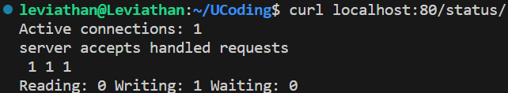

 

## Part 3. Мини веб-сервер

Для удобства, дальнейшие действия были прописаны в виде скрипта.

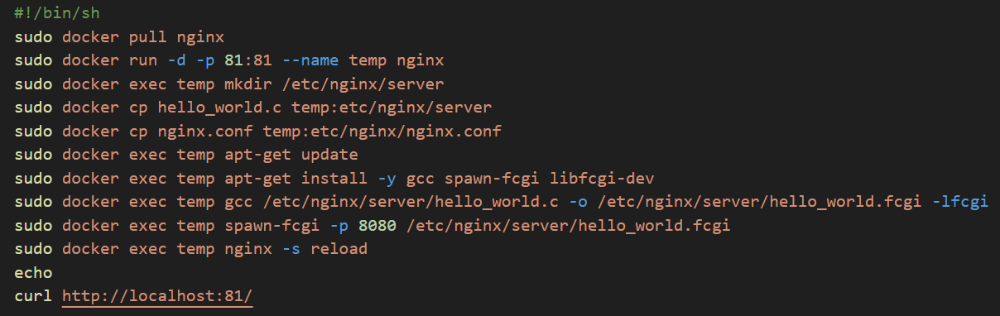

1. Запустить написанный мини сервер через spawn-fcgi на порту 8080;

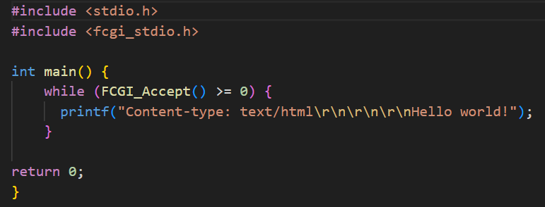

 

2. Написать свой nginx.conf, который будет проксировать все запросы с 81 порта на 127.0.0.1:8080;

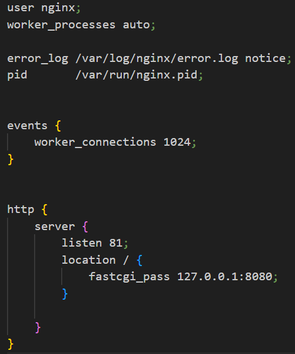

> ./build.sh

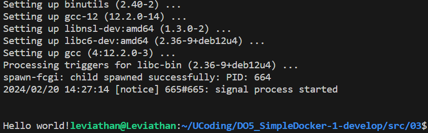

 

3. Проверить, что в браузере по localhost:81 отдается написанная вами страничка.

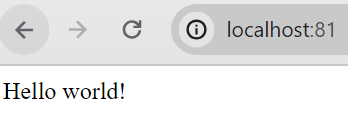

 

## Part 4. Свой докер

1. Написать свой докер образ, который:
- собирает исходники мини сервера на FastCgi из Части 3;
- запускает его на 8080 порту;
- копирует внутрь образа написанный ./nginx/nginx.conf;
- запускает nginx.

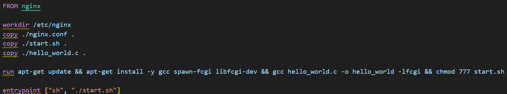

 

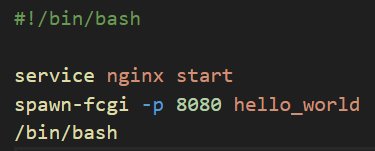

 

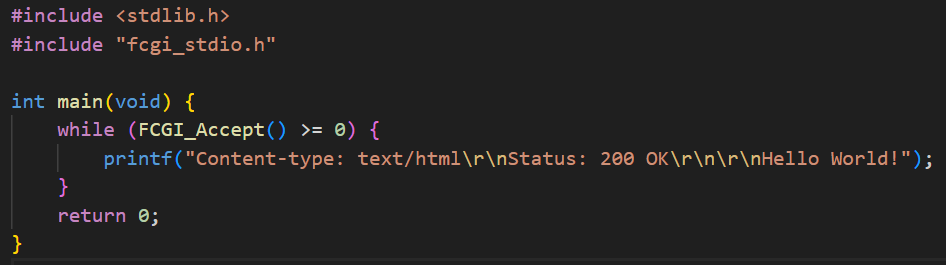

 

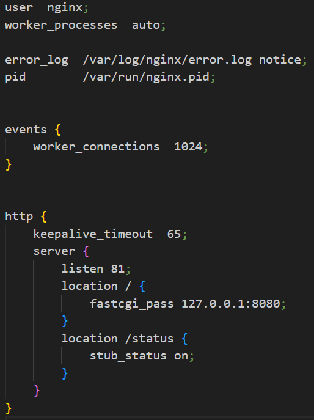

 

1. Собрать написанный докер образ через docker build при этом указав имя и тег;

> docker build -t helloworld:latest .

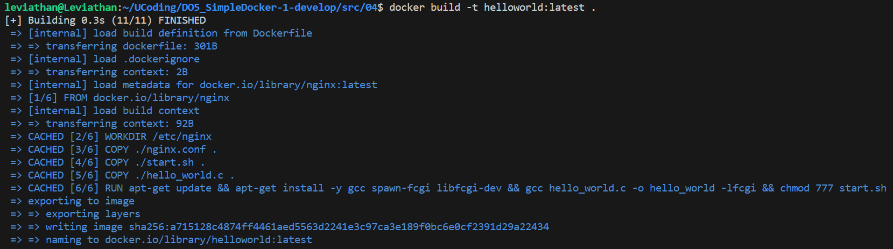

 

2. Проверить через docker images, что все собралось корректно. Запустить собранный докер образ с маппингом 81 порта на 80 на локальной машине и маппингом папки ./nginx внутрь контейнера по адресу, где лежат конфигурационные файлы nginx'а ;

> docker images

> docker run -it -p 80:81 -v $(pwd)/nginx.conf:/etc/nginx/nginx.conf -d helloworld:latest

> docker ps -a 

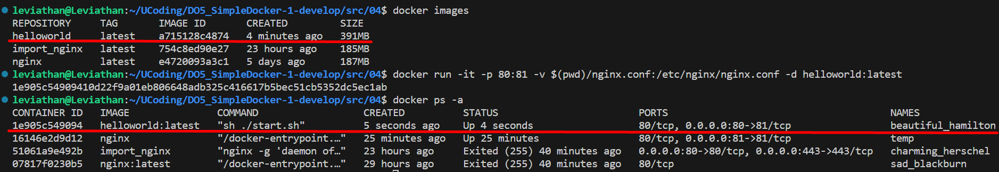

 

3. Проверить, что по localhost:80/status отдается страничка со статусом nginx. Проверить, что по localhost:80 доступна страничка написанного мини сервера;

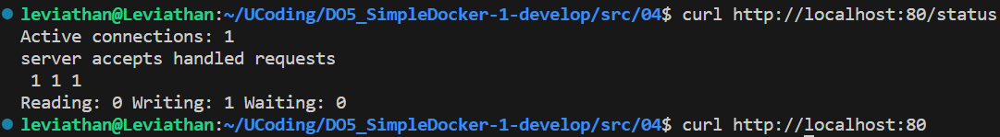

 

## Part 5. Dockle

Перед выполнением нужно установить Dockle. Для удобвство установка записана в виде скрипта install_Dockle.sh.

1. Просканировать образ из предыдущего задания через dockle [image_id|repository]

> dockle helloworld

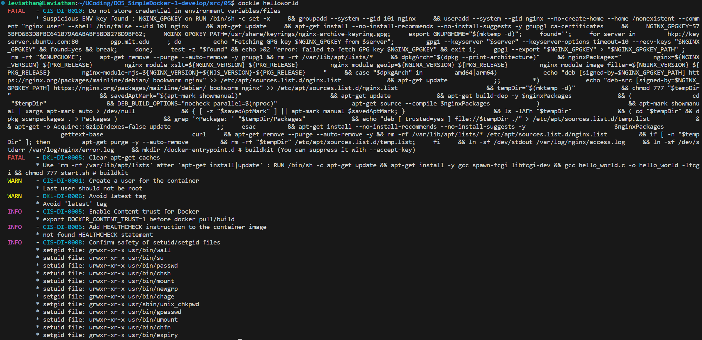

 

2. Исправить образ так, чтобы при проверке через dockle не было ошибок и предупреждений

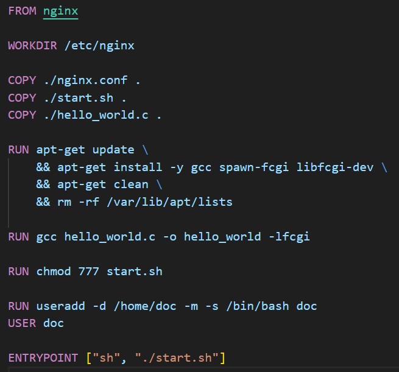

После этого загружаем обновлённую версию.

> docker build -t helloworld:fixed .

 

В случае возникновения ошибок CIS-DI-0010, может понадобвится прописать дополнительные параметры:

Команда --ak NGINX_GPGKEY_PATH указывает путь к ключу GPG, который Dockle должен использовать в процессе сканирования.

Команда --ak NGINX_GPGKEY предоставляет метку или псевдоним для ключа GPG, указанного с помощью --ak.

> dockle --ak NGINX_GPGKEY_PATH --ak NGINX_GPGKEY helloworld:fixed

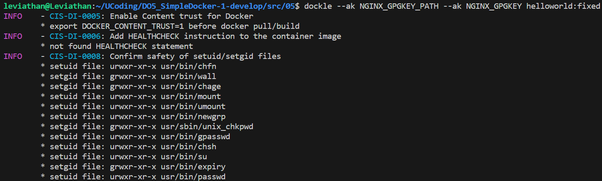

 

## Part 6. Базовый Docker Compose

Написать файл docker-compose.yml, с помощью которого:

1) Поднять докер контейнер из Части 5 (он должен работать в локальной сети, т.е. не нужно использовать инструкцию EXPOSE и мапить порты на локальную машину)
2) Поднять докер контейнер с nginx, который будет проксировать все запросы с 8080 порта на 81 порт первого контейнера

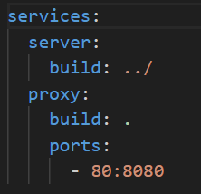

 Содержание файла docker-compose.yml 

 

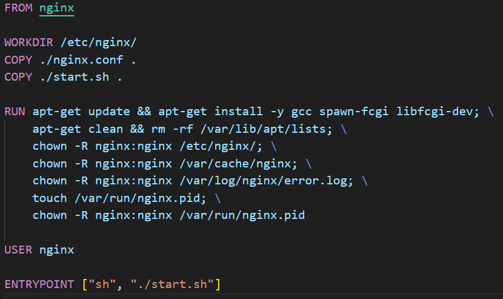

 Содержание файла Dockerfile  

 

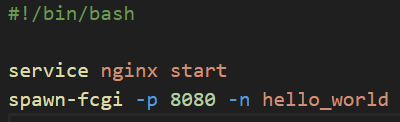

 Содержание bash-скрипта start.sh  

 

 Содержание nginx.conf  

 

1. Остановить все запущенные контейнеры. Cобрать и запустить проект с помощью команд docker-compose build и docker-compose up;

> docker images

> docker ps

> docker-compose build

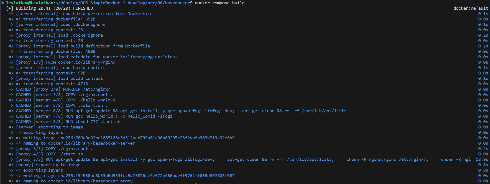

 

> docker-compose up -d

> docker ps

> curl http://localhost:80

> curl http://localhost:80/status/

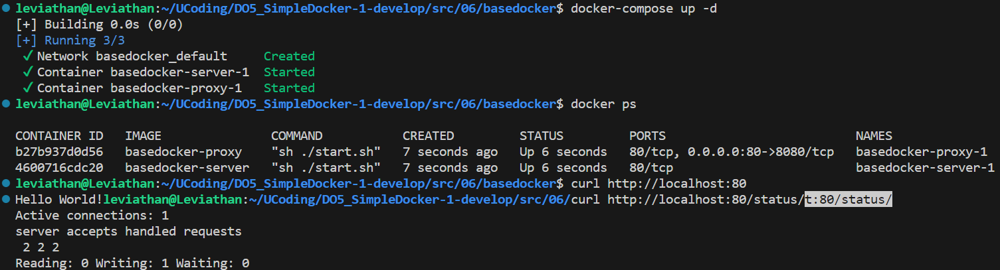

 

2. Проверить, что в браузере по localhost:80 отдается написанная вами страничка

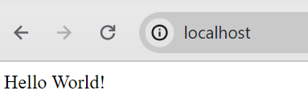

 
